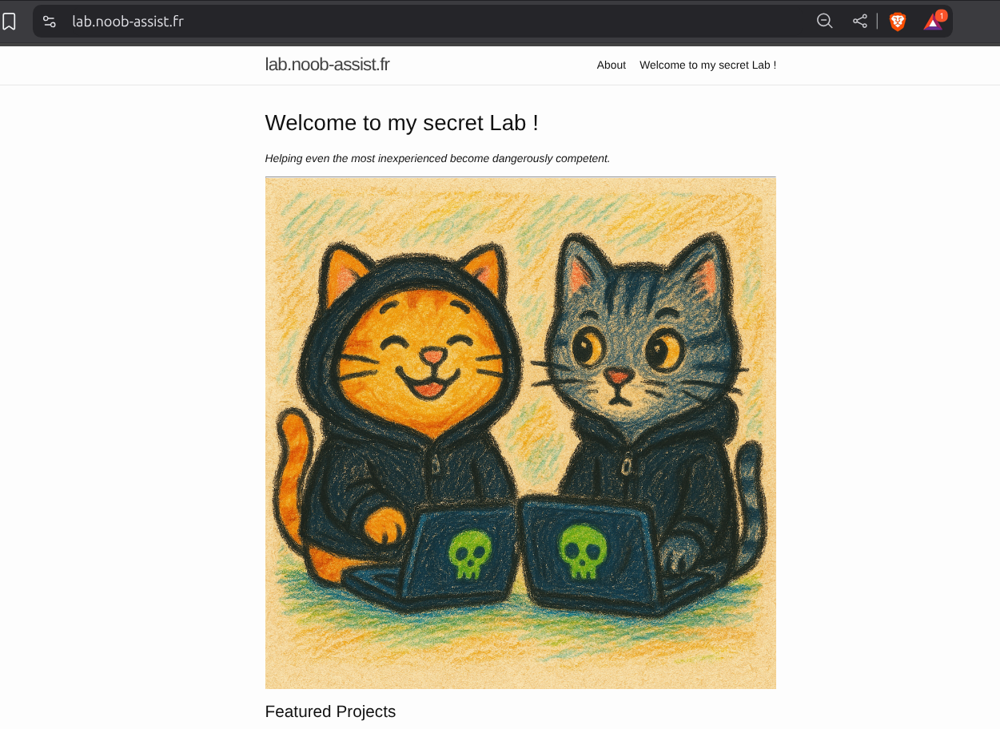

# 🦖 lab.noob-assist.fr

A self-hosted, DNS-aware, reverse-proxied **homelab** infrastructure project — built for learning, automation, and fun.

🔗 **Live demo**: [https://lab.noob-assist.fr](https://lab.noob-assist.fr)

---

## 🧪 Project Overview

This project sets up a full internal network and static site deployment pipeline using open-source tools, running on minimal hardware with Proxmox.

### 🔧 Tech Stack & Tools

- **OPNsense** on a Mini PC
- **Proxmox VE** turned my old computer into a bare metal
- **LXC containers**:
  - `Bind9` DNS server with forward/reverse zones
  - `Apache2` serving a **Jekyll** static site
  - `Nginx Proxy Manager` for HTTPS reverse proxy
- **Dynamic DNS updates** between OPNsense & Bind9
- **Let's Encrypt** SSL (via NPM)
- **VS Code Remote SSH** for editing the site

---

## 🗺️ Network Topology

[Internet]
↓
[ISP Box] (DMZ)
↓
[OPNsense] ↔ VLAN Switch ↔ [Proxmox]
↳ LXC: Apache (Jekyll)
↳ LXC: Bind9 DNS
↳ LXC: Nginx Proxy Manager

---

## 🧩 Features

- 🧠 **Learning-focused setup**: covers DNS, NAT, SSL, reverse proxy, and automation
- 🧷 Dynamic DNS using `nsupdate` with `HMAC-SHA512`
- 🌐 Internal zone: `rootosaurus.lan`, Public domain: `lab.noob-assist.fr`
- 🔐 Reverse proxy with HTTPS certs (auto-renewed)
- 💾 Full infrastructure runs on lightweight containers (LXC)
- ✍️ Static site built with **Jekyll**, edited via **VS Code Remote SSH**

---

## 📸 Screenshot

>  
> *Static site homepage from `lab.noob-assist.fr`*

---

## 🗃️ Folders (Not included in repo)

This GitHub repo doesn't contain the full infrastructure (e.g., LXC containers, DNS zones), but it links to the live result and explains the steps.
I made an exercice available on the website to reproduce what I did. 

---

> ✨ Built in a weekend from scratch by [Pishon](https://github.com/pishon), with love, VLANs, and dinosaur references.